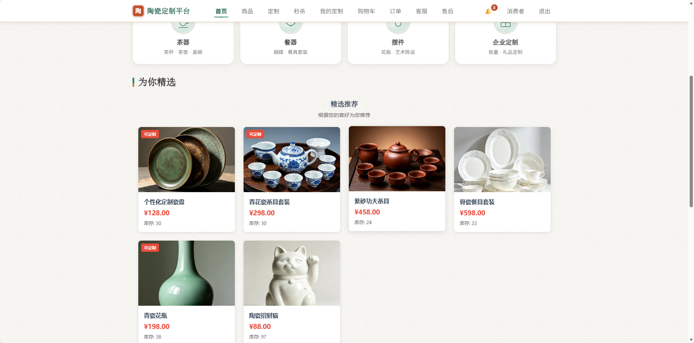
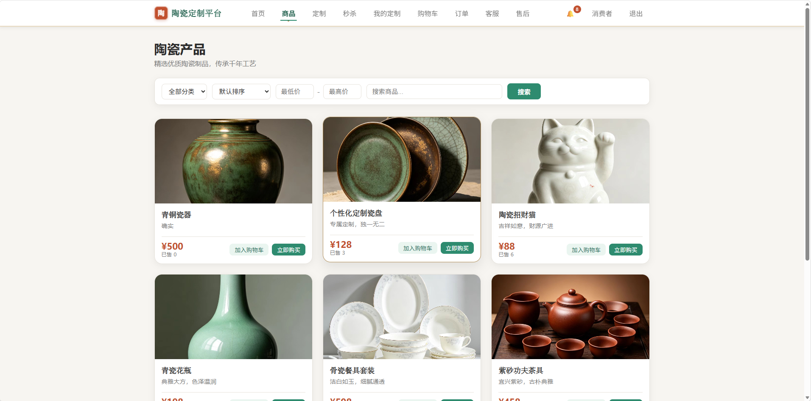
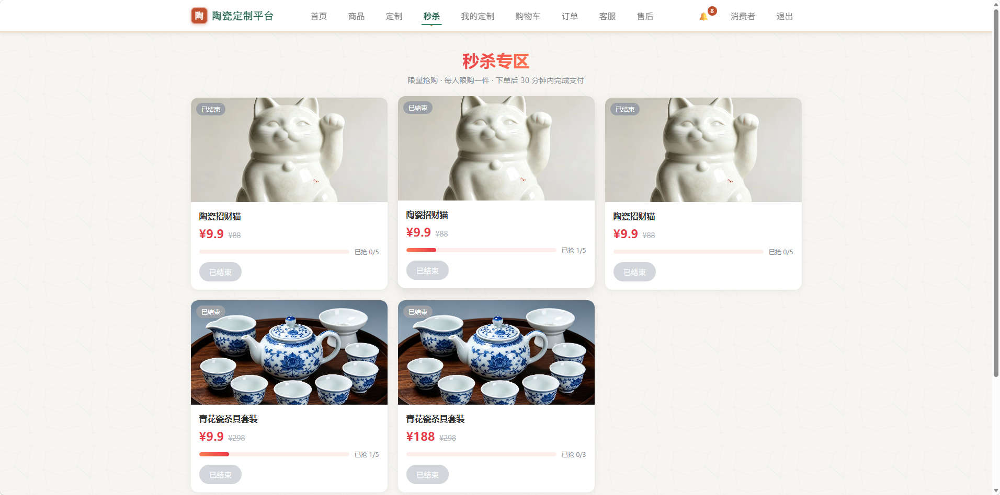

# 🏺 Ceramic Platform · 陶瓷定制电商全栈平台

> 一个从 0 到 1 **独立开发**的单商户陶瓷电商系统（前端 / 后端 / 中间件 / 压测脚本 / 部署脚本全部自研），
> 覆盖 **商品 / 购物车 / 订单 / 支付 / 售后 / 定制 / 秒杀 / 客服** 全业务闭环，
> 并重点打磨了 **高并发秒杀、缓存高可用、支付一致性** 三块后端核心能力。


**作者**：[@zhanpeng1324-alt](https://github.com/zhanpeng1324-alt) · 个人全栈项目

---

## 📸 项目预览

> 截图待补充。把图片放进 `docs/screenshots/` 目录，然后取消下面对应行的注释即可。

<!--
| 首页 | 商品详情 | 秒杀活动 |
|---|---|---|
|  |  |  |

| 购物车/下单 | 订单与售后 | 后台管理 |
|---|---|---|
|  |  |  |
-->

---

## ✨ 功能特性

- 🛒 **完整交易闭环**：浏览商品 → 加购物车 → 下单 → 支付 → 发货物流 → 确认收货 → 退款售后
- ⚡ **限量秒杀**：高并发抢购，物理杜绝超卖与一人多单，抢到后 30 分钟未付款自动取消回补库存
- 🎨 **陶瓷定制**：支持定金 + 尾款两段式支付的定制下单流程
- 💬 **AI 智能客服**：接入 DeepSeek，结合陶瓷知识库回答用户咨询
- 👤 **多角色权限**：管理员 / 顾客 / 客服三种角色，各司其职
- 🛠 **后台管理**：商品、订单、秒杀活动、售后工单管理，敏感操作全量审计

---

## 🧱 技术栈

| 层 | 技术 |
|---|---|
| 后端 | Spring Boot 3.2、MyBatis、MySQL 8.0、Redis 7（Redisson）、RabbitMQ 3.13 |
| 前端 | Vue 3 + TypeScript + Pinia + Vite |
| 工程化 | 多阶段 Dockerfile、docker compose、JWT 认证、管理端审计日志 |

---

## 🎯 核心技术设计

### 秒杀链路（Redis + Lua + MQ）
- **Lua 脚本原子三步**：`SISMEMBER` 防重复购买 → 判断库存 → `DECR` 扣减 + `SADD` 登记已购，物理上杜绝超卖与一人多单
- **削峰**：抢购成功仅投递 RabbitMQ，订单由消费者异步落库；30 分钟 TTL 延迟消息 → 死信队列超时未支付自动取消并**双回补**（Redis 库存/资格 + DB）
- **在途消息兜底**：活动下线时对已发出的延迟消息做丢弃防护，防止停售后仍产生订单
- **降级**：Redis 不可用时自动降级为数据库乐观锁（`UPDATE ... WHERE stock > 0`）CAS 扣减，唯一索引兜底一人一单
- **退款联动**：已支付订单退款/管理员取消时，同步秒杀单状态（不回补资格，防止"退款再抢"）

### 缓存高可用三防
- **防穿透**：Redisson 布隆过滤器（预热全量 id + 新品钩子）+ 空值占位；断连自动降级放行
- **防击穿**：分布式锁互斥重建 + 双重检查
- **防雪崩**：TTL 随机抖动（600s ± 120s）；查询失败 60s 冷却期直查 DB，保证"Redis 挂了应用照常跑"

### 支付与数据一致性
- 统一收银台组件承接 订单/秒杀/定制定金/定制尾款 四类支付
- CAS 状态守卫更新（`updateStatusGuarded`）防止并发状态跳变；支付幂等校验；退款金额封顶（实付 - 累计已退）
- 管理端敏感操作全量审计日志（audit_logs）

### 权限
RBAC（admin/customer/service 三角色）+ 逐接口资源归属校验 + 管理端双重权限（拦截器 + 控制器层复查）

---

## 📊 压测数据

> 单机环境：i7-12700H / 15.7G / MySQL + Redis 同机 / JMeter。数字为单机保守值，结论以**开关缓存 / 开关防护的相对对比**为准。

| 场景 | 结果 |
|---|---|
| 商品详情 200 并发，缓存开启 | **2,761 QPS，P99 130ms**，16 万+ 请求零失败 |
| 同接口关闭缓存（对照） | 67 QPS，P99 2,211ms |
| 秒杀 1,000 用户瞬时抢购（库存 200） | 成功订单恰 200，**零超卖、零重复**，约 670 QPS |
| 恶意 id 防穿透（43 万次请求） | 布隆全拦，压测期间 `Innodb_rows_read` 增量为 0，7,207 QPS |

---

## 🧭 开发迭代（功能演进记录）

项目未接入 Flyway，但完整保留了手工数据库迁移脚本 `db/migration/V2 → V16`，**每个脚本对应一次真实的功能迭代**，可据此看到系统从核心交易一步步扩展到定制、售后、支付、通知等模块的过程：

| 方向 | 迭代脚本 | 内容 |
|---|---|---|
| 基础能力 | V2 · V3 · V4 · V5 | AI 客服接入、管理端审计日志、业务状态归一化、后台统计索引优化 |
| 陶瓷定制 | V3_1 · V6 · V12 · V16 | 定制报价、定制下单流程、定金/尾款两段支付、定制收货地址 |
| 售后与履约 | V7 · V9 · V10 | 售后工单流程、订单发货与物流、评价回复 |
| 支付与通知 | V8 · V11 · V13 | 客服会话 AI 摘要、支付网关抽象、站内通知 |
| 店铺运营 | V14 · V15 | 店铺设置、商品多图图册 |

> 迁移脚本均做了幂等保护（`IF NOT EXISTS` / 基于 `INFORMATION_SCHEMA` 的加列判断），可重复执行；执行顺序与说明见 [db/README.md](platform.back/src/main/resources/db/README.md)。

---

## 🚀 快速启动

前置：JDK 17+、Node 18+、Docker、Maven（wrapper 自带）

```bash
# 1) 启动中间件（Redis + RabbitMQ；MySQL 请用本机安装的实例）
cd platform.back && docker compose up -d rabbitmq redis && cd ..

# 2) 初始化数据库（一条命令：自动建库 + 建全表，结构已完整到最新）
cd platform.back/src/main/resources/db
DB_USER=root DB_PASSWORD=你的MySQL密码 bash apply_all.sh --fresh
cd -

# 3) 后端（默认 dev profile；中间件不可用会自动降级直查 DB，应用照常启动）
cd platform.back && ./mvnw spring-boot:run

# 4) 前端
cd ceramic.ui && npm install && npm run dev   # http://localhost:5173
```

> 数据库连接参数（库名/账号/密码/host/port）可用环境变量覆盖，默认 `ceramic / root / 123456 / 127.0.0.1 / 3306`。
> 老库增量升级请看 [db/README.md](platform.back/src/main/resources/db/README.md) 的「场景 B」。

**默认演示账号**（演示短信登录，验证码回显在前端提示中）：
- 管理员：`13800000000`
- 顾客：任意 `139xxxxxxxx` 手机号自动注册

**AI 客服**：需配置环境变量 `DEEPSEEK_API_KEY`（不要写进代码文件）；未配置时其余功能不受影响。

---

## 📁 目录结构

```
platform.back   # Spring Boot 后端（seckill / mq / cache / config 按域分包）
  └─ src/main/resources/db   # 建表与迁移脚本
ceramic.ui      # Vue 3 前端（views/product | seckill | customize | admin 分域）
perf-test       # JMeter 场景脚本 + Node 回归脚本（regression-test*.mjs 可重复执行）
docs/screenshots # 项目截图
```

---

## ✅ 测试与验证

- **回归脚本**：`node perf-test/regression-test.mjs`（核心交易链 17 项）+ `regression-test-2.mjs`（订单流转/定制链/周边 12 项），前后端启动即可跑
- **压测**：JMeter 打开 `perf-test/SeckillPerfTest.jmx`，三个线程组对应上表三个场景

---

## 🔒 生产部署要点

- 使用 `prod` profile（`application-prod.properties`），所有敏感项**强制环境变量**注入，缺失即启动失败，示例见 [.env.example](platform.back/.env.example)：
  `DB_URL / DB_USERNAME / DB_PASSWORD / JWT_SECRET / DEEPSEEK_API_KEY / SMS_DEMO_MODE=false`
- 短信验证码回显仅限本地开发（`sms.demo-mode=true`）；生产必须接入真实短信通道并将 `SMS_DEMO_MODE` 置 `false`
- docker compose 中间件密码均已参数化，生产请务必覆盖默认值
